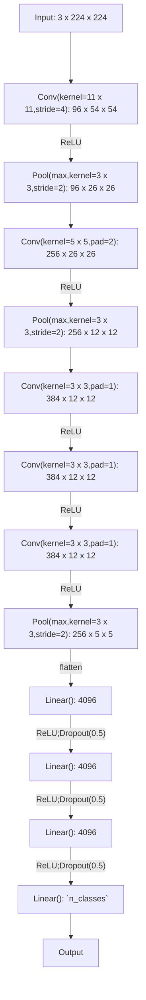

# AlexNet

The model was presented in [^Krizhevsky-2012].

Implementation is based on [this article](https://blog.paperspace.com/alexnet-pytorch/#alexnet-from-scratch).

[^Krizhevsky-2012]: Krizhevsky A, Sutskever I, Hinton GE. ImageNet Classification 
with Deep Convolutional Neural Networks. In: Pereira F, Burges CJ, 
Bottou L, Weinberger KQ, eds. Advances in Neural Information Processing 
Systems. Vol 25. Curran Associates, Inc.; 2012. [doi:10.1145/3065386](https://doi.org/10.1145/3065386)

## Model structure



```
==========================================================================================
Layer (type:depth-idx)                   Output Shape              Param #
==========================================================================================
AlexNet                                  [1, 3]                    --
├─Sequential: 1-1                        [1, 96, 26, 26]           --
│    └─Conv2d: 2-1                       [1, 96, 54, 54]           34,944
│    └─BatchNorm2d: 2-2                  [1, 96, 54, 54]           192
│    └─ReLU: 2-3                         [1, 96, 54, 54]           --
│    └─MaxPool2d: 2-4                    [1, 96, 26, 26]           --
├─Sequential: 1-2                        [1, 256, 12, 12]          --
│    └─Conv2d: 2-5                       [1, 256, 26, 26]          614,656
│    └─BatchNorm2d: 2-6                  [1, 256, 26, 26]          512
│    └─ReLU: 2-7                         [1, 256, 26, 26]          --
│    └─MaxPool2d: 2-8                    [1, 256, 12, 12]          --
├─Sequential: 1-3                        [1, 384, 12, 12]          --
│    └─Conv2d: 2-9                       [1, 384, 12, 12]          885,120
│    └─BatchNorm2d: 2-10                 [1, 384, 12, 12]          768
│    └─ReLU: 2-11                        [1, 384, 12, 12]          --
├─Sequential: 1-4                        [1, 384, 12, 12]          --
│    └─Conv2d: 2-12                      [1, 384, 12, 12]          1,327,488
│    └─BatchNorm2d: 2-13                 [1, 384, 12, 12]          768
│    └─ReLU: 2-14                        [1, 384, 12, 12]          --
├─Sequential: 1-5                        [1, 256, 5, 5]            --
│    └─Conv2d: 2-15                      [1, 256, 12, 12]          884,992
│    └─BatchNorm2d: 2-16                 [1, 256, 12, 12]          512
│    └─ReLU: 2-17                        [1, 256, 12, 12]          --
│    └─MaxPool2d: 2-18                   [1, 256, 5, 5]            --
├─Flatten: 1-6                           [1, 6400]                 --
├─Sequential: 1-7                        [1, 4096]                 --
│    └─Dropout: 2-19                     [1, 6400]                 --
│    └─Linear: 2-20                      [1, 4096]                 26,218,496
│    └─ReLU: 2-21                        [1, 4096]                 --
├─Sequential: 1-8                        [1, 4096]                 --
│    └─Dropout: 2-22                     [1, 4096]                 --
│    └─Linear: 2-23                      [1, 4096]                 16,781,312
│    └─ReLU: 2-24                        [1, 4096]                 --
├─Sequential: 1-9                        [1, 3]                    --
│    └─Linear: 2-25                      [1, 3]                    12,291
==========================================================================================
Total params: 46,762,051
Trainable params: 46,762,051
Non-trainable params: 0
Total mult-adds (Units.GIGABYTES): 1.01
==========================================================================================
Input size (MB): 0.60
Forward/backward pass size (MB): 9.67
Params size (MB): 187.05
Estimated Total Size (MB): 197.32
==========================================================================================
```

## Customizing AlexNet
