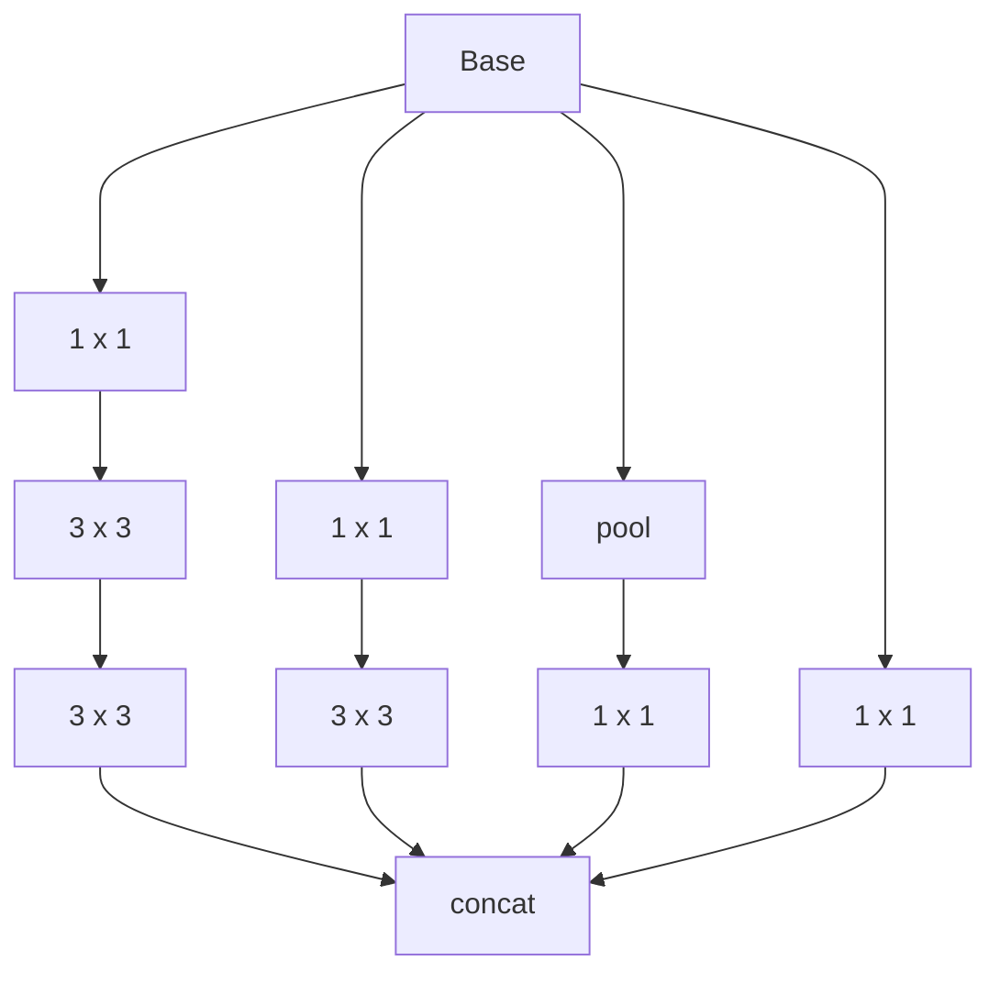
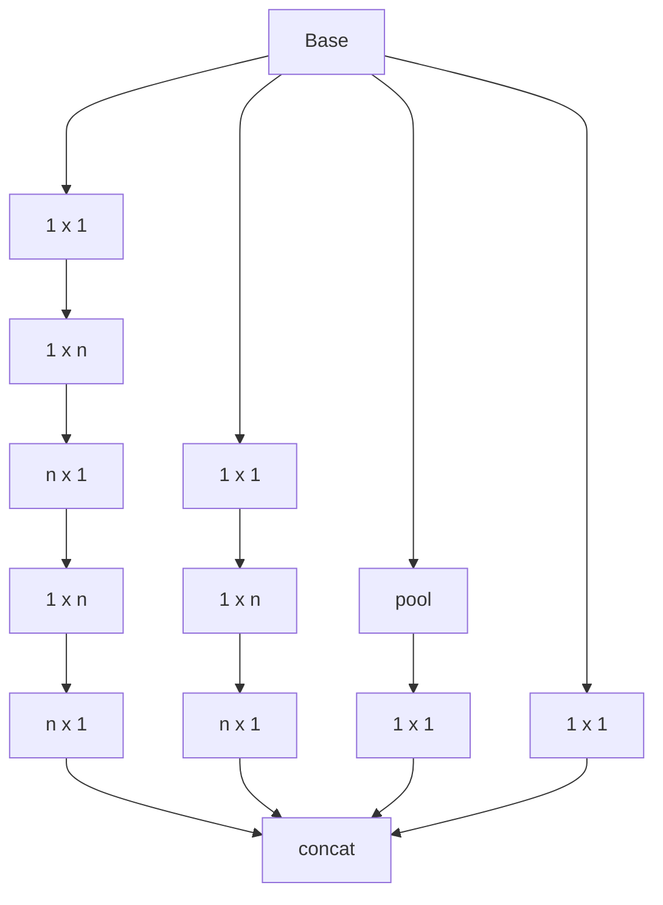
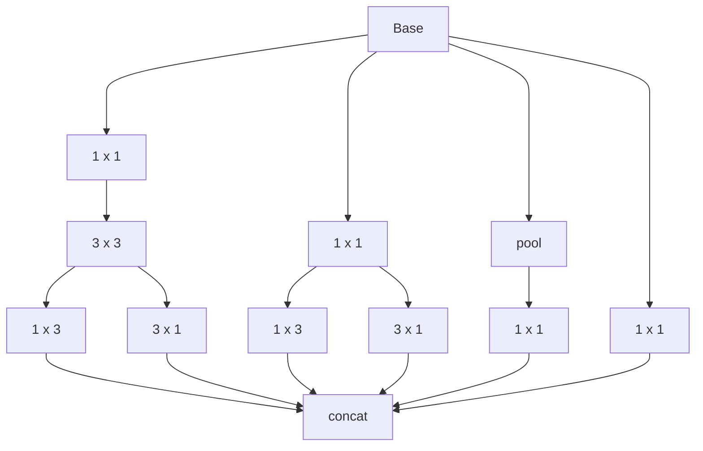
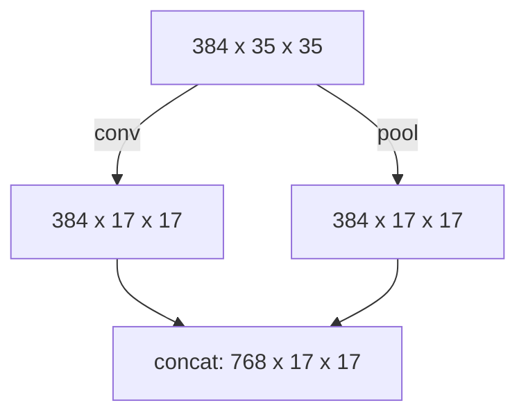

# Inception V2

The model was presented in [^Szegedy-2016].

The implementation is based on [this article](https://medium.com/nerd-for-tech/know-about-inception-v2-and-v3-implementation-using-pytorch-b1d96b2c1aa5).

[^Szegedy-2016]: Szegedy C, Vanhoucke V, Ioffe S, Shlens J, Wojna ZB. 
    Rethinking the Inception Architecture for Computer Vision. 
    2016. [doi:10.1109/CVPR.2016.308](https://doi.org/10.1109/CVPR.2016.308)

## Structure

| type             | kernel size/stride or remark | input size |
|------------------|:----------------------------:|:----------:|
| conv             |             3x3/2            |  3x299x299 |
| conv             |             3x3/1            | 32x149x149 |
| conv pad         |             3x3/1            | 32x147x147 |
| pool             |             3x3/2            | 64x147x147 |
| conv             |             3x3/1            |  64x73x73  |
| conv             |             3x3/2            |  80x71x71  |
| conv             |             3x3/1            |  192x35x35 |
| 3 x Inception F5 |                              |  288x35x35 |
| 5 x Inception F6 |                              |  768x17x17 |
| 2 x Inception F7 |                              |  1280x8x8  |
| pool             |              8x8             |  2048x8x8  |
| linear           |            logits            |   2048x1   |
| softmax          |          classifier          |   1000x1   |

```text
===============================================================================================
Layer (type:depth-idx)                        Output Shape              Param #
===============================================================================================
InceptionV2                                   [1, 1000]                 --
├─Sequential: 1-1                             [1, 288, 35, 35]          --
│    └─BasicConv2d: 2-1                       [1, 32, 149, 149]         --
│    │    └─Conv2d: 3-1                       [1, 32, 149, 149]         864
│    │    └─BatchNorm2d: 3-2                  [1, 32, 149, 149]         64
│    └─BasicConv2d: 2-2                       [1, 32, 147, 147]         --
│    │    └─Conv2d: 3-3                       [1, 32, 147, 147]         9,216
│    │    └─BatchNorm2d: 3-4                  [1, 32, 147, 147]         64
│    └─BasicConv2d: 2-3                       [1, 64, 147, 147]         --
│    │    └─Conv2d: 3-5                       [1, 64, 147, 147]         18,432
│    │    └─BatchNorm2d: 3-6                  [1, 64, 147, 147]         128
│    └─MaxPool2d: 2-4                         [1, 64, 73, 73]           --
│    └─BasicConv2d: 2-5                       [1, 80, 71, 71]           --
│    │    └─Conv2d: 3-7                       [1, 80, 71, 71]           46,080
│    │    └─BatchNorm2d: 3-8                  [1, 80, 71, 71]           160
│    └─BasicConv2d: 2-6                       [1, 192, 35, 35]          --
│    │    └─Conv2d: 3-9                       [1, 192, 35, 35]          138,240
│    │    └─BatchNorm2d: 3-10                 [1, 192, 35, 35]          384
│    └─BasicConv2d: 2-7                       [1, 288, 35, 35]          --
│    │    └─Conv2d: 3-11                      [1, 288, 35, 35]          497,664
│    │    └─BatchNorm2d: 3-12                 [1, 288, 35, 35]          576
├─Sequential: 1-2                             [1, 384, 35, 35]          --
│    └─InceptionModuleF5: 2-8                 [1, 384, 35, 35]          --
│    │    └─InceptionBranch: 3-13             [1, 96, 35, 35]           194,112
│    │    └─InceptionBranch: 3-14             [1, 96, 35, 35]           110,976
│    │    └─InceptionBranch: 3-15             [1, 96, 35, 35]           27,840
│    │    └─InceptionBranch: 3-16             [1, 96, 35, 35]           27,840
│    └─InceptionModuleF5: 2-9                 [1, 384, 35, 35]          --
│    │    └─InceptionBranch: 3-17             [1, 96, 35, 35]           203,328
│    │    └─InceptionBranch: 3-18             [1, 96, 35, 35]           120,192
│    │    └─InceptionBranch: 3-19             [1, 96, 35, 35]           37,056
│    │    └─InceptionBranch: 3-20             [1, 96, 35, 35]           37,056
│    └─InceptionModuleF5: 2-10                [1, 384, 35, 35]          --
│    │    └─InceptionBranch: 3-21             [1, 96, 35, 35]           203,328
│    │    └─InceptionBranch: 3-22             [1, 96, 35, 35]           120,192
│    │    └─InceptionBranch: 3-23             [1, 96, 35, 35]           37,056
│    │    └─InceptionBranch: 3-24             [1, 96, 35, 35]           37,056
├─GridReduction: 1-3                          [1, 768, 17, 17]          --
│    └─Sequential: 2-11                       [1, 384, 17, 17]          --
│    │    └─BasicConv2d: 3-25                 [1, 384, 17, 17]          1,327,872
│    └─Sequential: 2-12                       [1, 384, 17, 17]          --
│    │    └─MaxPool2d: 3-26                   [1, 384, 17, 17]          --
├─AuxClassifier: 1-4                          [1, 1000]                 --
│    └─AdaptiveAvgPool2d: 2-13                [1, 768, 5, 5]            --
│    └─Conv2d: 2-14                           [1, 128, 5, 5]            98,432
│    └─Sequential: 2-15                       [1, 1000]                 --
│    │    └─Linear: 3-27                      [1, 1024]                 3,277,824
│    │    └─BatchNorm1d: 3-28                 [1, 1024]                 2,048
│    │    └─Linear: 3-29                      [1, 1000]                 1,025,000
├─Sequential: 1-5                             [1, 640, 17, 17]          --
│    └─InceptionModuleF6: 2-16                [1, 640, 17, 17]          --
│    │    └─InceptionBranch: 3-30             [1, 160, 17, 17]          841,280
│    │    └─InceptionBranch: 3-31             [1, 160, 17, 17]          482,240
│    │    └─InceptionBranch: 3-32             [1, 160, 17, 17]          123,200
│    │    └─InceptionBranch: 3-33             [1, 160, 17, 17]          123,200
│    └─InceptionModuleF6: 2-17                [1, 640, 17, 17]          --
│    │    └─InceptionBranch: 3-34             [1, 160, 17, 17]          820,800
│    │    └─InceptionBranch: 3-35             [1, 160, 17, 17]          461,760
│    │    └─InceptionBranch: 3-36             [1, 160, 17, 17]          102,720
│    │    └─InceptionBranch: 3-37             [1, 160, 17, 17]          102,720
│    └─InceptionModuleF6: 2-18                [1, 640, 17, 17]          --
│    │    └─InceptionBranch: 3-38             [1, 160, 17, 17]          820,800
│    │    └─InceptionBranch: 3-39             [1, 160, 17, 17]          461,760
│    │    └─InceptionBranch: 3-40             [1, 160, 17, 17]          102,720
│    │    └─InceptionBranch: 3-41             [1, 160, 17, 17]          102,720
│    └─InceptionModuleF6: 2-19                [1, 640, 17, 17]          --
│    │    └─InceptionBranch: 3-42             [1, 160, 17, 17]          820,800
│    │    └─InceptionBranch: 3-43             [1, 160, 17, 17]          461,760
│    │    └─InceptionBranch: 3-44             [1, 160, 17, 17]          102,720
│    │    └─InceptionBranch: 3-45             [1, 160, 17, 17]          102,720
│    └─InceptionModuleF6: 2-20                [1, 640, 17, 17]          --
│    │    └─InceptionBranch: 3-46             [1, 160, 17, 17]          820,800
│    │    └─InceptionBranch: 3-47             [1, 160, 17, 17]          461,760
│    │    └─InceptionBranch: 3-48             [1, 160, 17, 17]          102,720
│    │    └─InceptionBranch: 3-49             [1, 160, 17, 17]          102,720
├─GridReduction: 1-6                          [1, 1280, 8, 8]           --
│    └─Sequential: 2-21                       [1, 640, 8, 8]            --
│    │    └─BasicConv2d: 3-50                 [1, 640, 8, 8]            3,687,680
│    └─Sequential: 2-22                       [1, 640, 8, 8]            --
│    │    └─MaxPool2d: 3-51                   [1, 640, 8, 8]            --
├─Sequential: 1-7                             [1, 2048, 8, 8]           --
│    └─InceptionModuleF7: 2-23                [1, 1024, 8, 8]           --
│    │    └─InceptionBranch: 3-52             [1, 512, 8, 8]            119,040
│    │    └─Sequential: 3-53                  [1, 256, 8, 8]            49,664
│    │    └─Sequential: 3-54                  [1, 256, 8, 8]            49,664
│    │    └─InceptionBranch: 3-55             [1, 384, 8, 8]            61,536
│    │    └─Sequential: 3-56                  [1, 192, 8, 8]            28,032
│    │    └─Sequential: 3-57                  [1, 192, 8, 8]            28,032
│    │    └─InceptionBranch: 3-58             [1, 64, 8, 8]             82,048
│    │    └─InceptionBranch: 3-59             [1, 64, 8, 8]             82,048
│    └─InceptionModuleF7: 2-24                [1, 2048, 8, 8]           --
│    │    └─InceptionBranch: 3-60             [1, 768, 8, 8]            181,632
│    │    └─Sequential: 3-61                  [1, 384, 8, 8]            111,360
│    │    └─Sequential: 3-62                  [1, 384, 8, 8]            111,360
│    │    └─InceptionBranch: 3-63             [1, 768, 8, 8]            98,496
│    │    └─Sequential: 3-64                  [1, 384, 8, 8]            111,360
│    │    └─Sequential: 3-65                  [1, 384, 8, 8]            111,360
│    │    └─InceptionBranch: 3-66             [1, 256, 8, 8]            262,656
│    │    └─InceptionBranch: 3-67             [1, 256, 8, 8]            262,656
├─AdaptiveAvgPool2d: 1-8                      [1, 2048, 1, 1]           --
├─Sequential: 1-9                             [1, 1000]                 --
│    └─Linear: 2-25                           [1, 1000]                 2,049,000
│    └─Softmax: 2-26                          [1, 1000]                 --
===============================================================================================
Total params: 22,608,624
Trainable params: 22,608,624
Non-trainable params: 0
Total mult-adds (Units.GIGABYTES): 5.95
===============================================================================================
Input size (MB): 1.07
Forward/backward pass size (MB): 143.03
Params size (MB): 90.43
Estimated Total Size (MB): 234.54
===============================================================================================
```

### Inception Modules

#### Inception Module F5

The module is presented on Figure 5 in [^Szegedy-2016].



```text
==========================================================================================
Layer (type:depth-idx)                   Output Shape              Param #
==========================================================================================
InceptionModuleF5                        [1, 384, 35, 35]          --
├─InceptionBranch: 1-1                   [1, 96, 35, 35]           --
│    └─BasicConv2d: 2-1                  [1, 96, 35, 35]           --
│    │    └─Conv2d: 3-1                  [1, 96, 35, 35]           27,648
│    │    └─BatchNorm2d: 3-2             [1, 96, 35, 35]           192
│    └─BasicConv2d: 2-2                  [1, 96, 35, 35]           --
│    │    └─Conv2d: 3-3                  [1, 96, 35, 35]           82,944
│    │    └─BatchNorm2d: 3-4             [1, 96, 35, 35]           192
│    └─BasicConv2d: 2-3                  [1, 96, 35, 35]           --
│    │    └─Conv2d: 3-5                  [1, 96, 35, 35]           82,944
│    │    └─BatchNorm2d: 3-6             [1, 96, 35, 35]           192
├─InceptionBranch: 1-2                   [1, 96, 35, 35]           --
│    └─BasicConv2d: 2-4                  [1, 96, 35, 35]           --
│    │    └─Conv2d: 3-7                  [1, 96, 35, 35]           27,648
│    │    └─BatchNorm2d: 3-8             [1, 96, 35, 35]           192
│    └─BasicConv2d: 2-5                  [1, 96, 35, 35]           --
│    │    └─Conv2d: 3-9                  [1, 96, 35, 35]           82,944
│    │    └─BatchNorm2d: 3-10            [1, 96, 35, 35]           192
├─InceptionBranch: 1-3                   [1, 96, 35, 35]           --
│    └─MaxPool2d: 2-6                    [1, 288, 35, 35]          --
│    └─BasicConv2d: 2-7                  [1, 96, 35, 35]           --
│    │    └─Conv2d: 3-11                 [1, 96, 35, 35]           27,648
│    │    └─BatchNorm2d: 3-12            [1, 96, 35, 35]           192
├─InceptionBranch: 1-4                   [1, 96, 35, 35]           --
│    └─BasicConv2d: 2-8                  [1, 96, 35, 35]           --
│    │    └─Conv2d: 3-13                 [1, 96, 35, 35]           27,648
│    │    └─BatchNorm2d: 3-14            [1, 96, 35, 35]           192
==========================================================================================
Total params: 360,768
Trainable params: 360,768
Non-trainable params: 0
Total mult-adds (Units.MEGABYTES): 440.30
==========================================================================================
Input size (MB): 1.41
Forward/backward pass size (MB): 13.17
Params size (MB): 1.44
Estimated Total Size (MB): 16.03
==========================================================================================
```

#### Inception Module F6

The module is presented in Figure 6 in [^Szegedy-2016].



```text
==========================================================================================
Layer (type:depth-idx)                   Output Shape              Param #
==========================================================================================
InceptionModuleF6                        [1, 640, 17, 17]          --
├─InceptionBranch: 1-1                   [1, 160, 17, 17]          --
│    └─BasicConv2d: 2-1                  [1, 160, 17, 17]          --
│    │    └─Conv2d: 3-1                  [1, 160, 17, 17]          122,880
│    │    └─BatchNorm2d: 3-2             [1, 160, 17, 17]          320
│    └─BasicConv2d: 2-2                  [1, 160, 17, 17]          --
│    │    └─Conv2d: 3-3                  [1, 160, 17, 17]          179,200
│    │    └─BatchNorm2d: 3-4             [1, 160, 17, 17]          320
│    └─BasicConv2d: 2-3                  [1, 160, 17, 17]          --
│    │    └─Conv2d: 3-5                  [1, 160, 17, 17]          179,200
│    │    └─BatchNorm2d: 3-6             [1, 160, 17, 17]          320
│    └─BasicConv2d: 2-4                  [1, 160, 17, 17]          --
│    │    └─Conv2d: 3-7                  [1, 160, 17, 17]          179,200
│    │    └─BatchNorm2d: 3-8             [1, 160, 17, 17]          320
│    └─BasicConv2d: 2-5                  [1, 160, 17, 17]          --
│    │    └─Conv2d: 3-9                  [1, 160, 17, 17]          179,200
│    │    └─BatchNorm2d: 3-10            [1, 160, 17, 17]          320
├─InceptionBranch: 1-2                   [1, 160, 17, 17]          --
│    └─BasicConv2d: 2-6                  [1, 160, 17, 17]          --
│    │    └─Conv2d: 3-11                 [1, 160, 17, 17]          122,880
│    │    └─BatchNorm2d: 3-12            [1, 160, 17, 17]          320
│    └─BasicConv2d: 2-7                  [1, 160, 17, 17]          --
│    │    └─Conv2d: 3-13                 [1, 160, 17, 17]          179,200
│    │    └─BatchNorm2d: 3-14            [1, 160, 17, 17]          320
│    └─BasicConv2d: 2-8                  [1, 160, 17, 17]          --
│    │    └─Conv2d: 3-15                 [1, 160, 17, 17]          179,200
│    │    └─BatchNorm2d: 3-16            [1, 160, 17, 17]          320
├─InceptionBranch: 1-3                   [1, 160, 17, 17]          --
│    └─AvgPool2d: 2-9                    [1, 768, 17, 17]          --
│    └─BasicConv2d: 2-10                 [1, 160, 17, 17]          --
│    │    └─Conv2d: 3-17                 [1, 160, 17, 17]          122,880
│    │    └─BatchNorm2d: 3-18            [1, 160, 17, 17]          320
├─InceptionBranch: 1-4                   [1, 160, 17, 17]          --
│    └─BasicConv2d: 2-11                 [1, 160, 17, 17]          --
│    │    └─Conv2d: 3-19                 [1, 160, 17, 17]          122,880
│    │    └─BatchNorm2d: 3-20            [1, 160, 17, 17]          320
==========================================================================================
Total params: 1,569,920
Trainable params: 1,569,920
Non-trainable params: 0
Total mult-adds (Units.MEGABYTES): 452.79
==========================================================================================
Input size (MB): 0.89
Forward/backward pass size (MB): 7.40
Params size (MB): 6.28
Estimated Total Size (MB): 14.57
==========================================================================================
```

#### Inception Module F7

The module is presented in Figure 7 in [^Szegedy-2016].



```text
==========================================================================================
Layer (type:depth-idx)                   Output Shape              Param #
==========================================================================================
InceptionModuleF7                        [1, 1024, 8, 8]           --
├─InceptionBranch: 1-1                   [1, 512, 8, 8]            --
│    └─BasicConv2d: 2-1                  [1, 64, 8, 8]             --
│    │    └─Conv2d: 3-1                  [1, 64, 8, 8]             81,920
│    │    └─BatchNorm2d: 3-2             [1, 64, 8, 8]             128
│    └─BasicConv2d: 2-2                  [1, 64, 8, 8]             --
│    │    └─Conv2d: 3-3                  [1, 64, 8, 8]             36,864
│    │    └─BatchNorm2d: 3-4             [1, 64, 8, 8]             128
├─Sequential: 1-2                        [1, 256, 8, 8]            --
│    └─BasicConv2d: 2-3                  [1, 256, 8, 8]            --
│    │    └─Conv2d: 3-5                  [1, 256, 8, 8]            49,152
│    │    └─BatchNorm2d: 3-6             [1, 256, 8, 8]            512
├─Sequential: 1-3                        [1, 256, 8, 8]            --
│    └─BasicConv2d: 2-4                  [1, 256, 8, 8]            --
│    │    └─Conv2d: 3-7                  [1, 256, 8, 8]            49,152
│    │    └─BatchNorm2d: 3-8             [1, 256, 8, 8]            512
├─InceptionBranch: 1-4                   [1, 384, 8, 8]            --
│    └─BasicConv2d: 2-5                  [1, 48, 8, 8]             --
│    │    └─Conv2d: 3-9                  [1, 48, 8, 8]             61,440
│    │    └─BatchNorm2d: 3-10            [1, 48, 8, 8]             96
├─Sequential: 1-5                        [1, 192, 8, 8]            --
│    └─BasicConv2d: 2-6                  [1, 192, 8, 8]            --
│    │    └─Conv2d: 3-11                 [1, 192, 8, 8]            27,648
│    │    └─BatchNorm2d: 3-12            [1, 192, 8, 8]            384
├─Sequential: 1-6                        [1, 192, 8, 8]            --
│    └─BasicConv2d: 2-7                  [1, 192, 8, 8]            --
│    │    └─Conv2d: 3-13                 [1, 192, 8, 8]            27,648
│    │    └─BatchNorm2d: 3-14            [1, 192, 8, 8]            384
├─InceptionBranch: 1-7                   [1, 64, 8, 8]             --
│    └─MaxPool2d: 2-8                    [1, 1280, 8, 8]           --
│    └─BasicConv2d: 2-9                  [1, 64, 8, 8]             --
│    │    └─Conv2d: 3-15                 [1, 64, 8, 8]             81,920
│    │    └─BatchNorm2d: 3-16            [1, 64, 8, 8]             128
├─InceptionBranch: 1-8                   [1, 64, 8, 8]             --
│    └─BasicConv2d: 2-10                 [1, 64, 8, 8]             --
│    │    └─Conv2d: 3-17                 [1, 64, 8, 8]             81,920
│    │    └─BatchNorm2d: 3-18            [1, 64, 8, 8]             128
==========================================================================================
Total params: 500,064
Trainable params: 500,064
Non-trainable params: 0
Total mult-adds (Units.MEGABYTES): 31.85
==========================================================================================
Input size (MB): 0.33
Forward/backward pass size (MB): 1.23
Params size (MB): 2.00
Estimated Total Size (MB): 3.56
==========================================================================================
```

#### Grid Size reduction



```text
==========================================================================================
Layer (type:depth-idx)                   Output Shape              Param #
==========================================================================================
GridReduction                            [1, 768, 17, 17]          --
├─Sequential: 1-1                        [1, 384, 17, 17]          --
│    └─BasicConv2d: 2-1                  [1, 384, 17, 17]          --
│    │    └─Conv2d: 3-1                  [1, 384, 17, 17]          1,327,104
│    │    └─BatchNorm2d: 3-2             [1, 384, 17, 17]          768
├─Sequential: 1-2                        [1, 384, 17, 17]          --
│    └─MaxPool2d: 2-2                    [1, 384, 17, 17]          --
==========================================================================================
Total params: 1,327,872
Trainable params: 1,327,872
Non-trainable params: 0
Total mult-adds (Units.MEGABYTES): 383.53
==========================================================================================
Input size (MB): 1.88
Forward/backward pass size (MB): 1.78
Params size (MB): 5.31
Estimated Total Size (MB): 8.97
==========================================================================================
```

## Customizing Inception V2