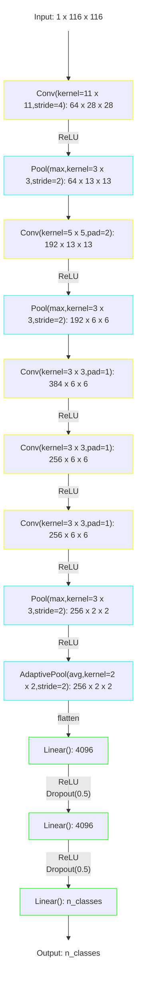

# AlexNet

The model was presented in [^Krizhevsky-2012].

The implementation from [`torchvision.models`](https://pytorch.org/vision/main/models/alexnet.html) is used.

[^Krizhevsky-2012]: Krizhevsky A, Sutskever I, Hinton GE. ImageNet Classification 
with Deep Convolutional Neural Networks. In: Pereira F, Burges CJ, 
Bottou L, Weinberger KQ, eds. Advances in Neural Information Processing 
Systems. Vol 25. Curran Associates, Inc.; 2012. [doi:10.1145/3065386](https://doi.org/10.1145/3065386)

## Model structure



```text
============================================================================================================================================
Layer (type:depth-idx)                   Kernel Shape              Input Shape               Output Shape              Param #
============================================================================================================================================
AlexNet                                  --                        [1, 1, 116, 116]          [1, 2]                    --
├─Sequential: 1-1                        --                        [1, 1, 116, 116]          [1, 256, 2, 2]            --
│    └─Conv2d: 2-1                       [11, 11]                  [1, 1, 116, 116]          [1, 64, 28, 28]           7,808
│    └─ReLU: 2-2                         --                        [1, 64, 28, 28]           [1, 64, 28, 28]           --
│    └─MaxPool2d: 2-3                    3                         [1, 64, 28, 28]           [1, 64, 13, 13]           --
│    └─Conv2d: 2-4                       [5, 5]                    [1, 64, 13, 13]           [1, 192, 13, 13]          307,392
│    └─ReLU: 2-5                         --                        [1, 192, 13, 13]          [1, 192, 13, 13]          --
│    └─MaxPool2d: 2-6                    3                         [1, 192, 13, 13]          [1, 192, 6, 6]            --
│    └─Conv2d: 2-7                       [3, 3]                    [1, 192, 6, 6]            [1, 384, 6, 6]            663,936
│    └─ReLU: 2-8                         --                        [1, 384, 6, 6]            [1, 384, 6, 6]            --
│    └─Conv2d: 2-9                       [3, 3]                    [1, 384, 6, 6]            [1, 256, 6, 6]            884,992
│    └─ReLU: 2-10                        --                        [1, 256, 6, 6]            [1, 256, 6, 6]            --
│    └─Conv2d: 2-11                      [3, 3]                    [1, 256, 6, 6]            [1, 256, 6, 6]            590,080
│    └─ReLU: 2-12                        --                        [1, 256, 6, 6]            [1, 256, 6, 6]            --
│    └─MaxPool2d: 2-13                   3                         [1, 256, 6, 6]            [1, 256, 2, 2]            --
├─AdaptiveAvgPool2d: 1-2                 --                        [1, 256, 2, 2]            [1, 256, 2, 2]            --
├─Sequential: 1-3                        --                        [1, 1024]                 [1, 3]                    --
│    └─Dropout: 2-14                     --                        [1, 1024]                 [1, 1024]                 --
│    └─Linear: 2-15                      --                        [1, 1024]                 [1, 4096]                 4,198,400
│    └─ReLU: 2-16                        --                        [1, 4096]                 [1, 4096]                 --
│    └─Dropout: 2-17                     --                        [1, 4096]                 [1, 4096]                 --
│    └─Linear: 2-18                      --                        [1, 4096]                 [1, 4096]                 16,781,312
│    └─ReLU: 2-19                        --                        [1, 4096]                 [1, 4096]                 --
│    └─Linear: 2-20                      --                        [1, 4096]                 [1, 2]                    12,291
============================================================================================================================================
Total params: 23,446,211
Trainable params: 23,446,211
Non-trainable params: 0
Total mult-adds (Units.MEGABYTES): 156.07
============================================================================================================================================
Input size (MB): 0.05
Forward/backward pass size (MB): 0.98
Params size (MB): 93.78
Estimated Total Size (MB): 94.82
============================================================================================================================================
```
