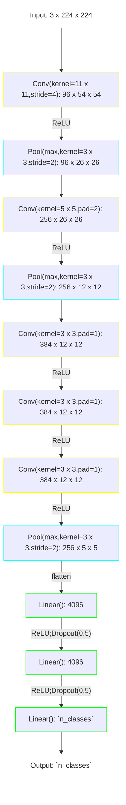

# AlexNet

The model was presented in [^Krizhevsky-2012].

Implementation is based on [this article](https://blog.paperspace.com/alexnet-pytorch/#alexnet-from-scratch).

[^Krizhevsky-2012]: Krizhevsky A, Sutskever I, Hinton GE. ImageNet Classification 
with Deep Convolutional Neural Networks. In: Pereira F, Burges CJ, 
Bottou L, Weinberger KQ, eds. Advances in Neural Information Processing 
Systems. Vol 25. Curran Associates, Inc.; 2012. [doi:10.1145/3065386](https://doi.org/10.1145/3065386)

## Model structure



```text
============================================================================================================================================
Layer (type:depth-idx)                   Kernel Shape              Input Shape               Output Shape              Param #
============================================================================================================================================
AlexNet                                  --                        [1, 3, 299, 299]          [1, 3]                    --
├─AlexNetFeatures: 1-1                   --                        [1, 3, 299, 299]          [1, 256, 8, 8]            --
│    └─Sequential: 2-1                   --                        [1, 3, 299, 299]          [1, 96, 36, 36]           --
│    │    └─Conv2d: 3-1                  [11, 11]                  [1, 3, 299, 299]          [1, 96, 73, 73]           34,944
│    │    └─ReLU: 3-2                    --                        [1, 96, 73, 73]           [1, 96, 73, 73]           --
│    │    └─LocalResponseNorm: 3-3       --                        [1, 96, 73, 73]           [1, 96, 73, 73]           --
│    │    └─MaxPool2d: 3-4               3                         [1, 96, 73, 73]           [1, 96, 36, 36]           --
│    └─Sequential: 2-2                   --                        [1, 96, 36, 36]           [1, 256, 17, 17]          --
│    │    └─Conv2d: 3-5                  [5, 5]                    [1, 96, 36, 36]           [1, 256, 36, 36]          614,656
│    │    └─ReLU: 3-6                    --                        [1, 256, 36, 36]          [1, 256, 36, 36]          --
│    │    └─LocalResponseNorm: 3-7       --                        [1, 256, 36, 36]          [1, 256, 36, 36]          --
│    │    └─MaxPool2d: 3-8               3                         [1, 256, 36, 36]          [1, 256, 17, 17]          --
│    └─Sequential: 2-3                   --                        [1, 256, 17, 17]          [1, 384, 17, 17]          --
│    │    └─Conv2d: 3-9                  [3, 3]                    [1, 256, 17, 17]          [1, 384, 17, 17]          885,120
│    │    └─ReLU: 3-10                   --                        [1, 384, 17, 17]          [1, 384, 17, 17]          --
│    └─Sequential: 2-4                   --                        [1, 384, 17, 17]          [1, 384, 17, 17]          --
│    │    └─Conv2d: 3-11                 [3, 3]                    [1, 384, 17, 17]          [1, 384, 17, 17]          1,327,488
│    │    └─ReLU: 3-12                   --                        [1, 384, 17, 17]          [1, 384, 17, 17]          --
│    └─Sequential: 2-5                   --                        [1, 384, 17, 17]          [1, 256, 8, 8]            --
│    │    └─Conv2d: 3-13                 [3, 3]                    [1, 384, 17, 17]          [1, 256, 17, 17]          884,992
│    │    └─ReLU: 3-14                   --                        [1, 256, 17, 17]          [1, 256, 17, 17]          --
│    │    └─MaxPool2d: 3-15              3                         [1, 256, 17, 17]          [1, 256, 8, 8]            --
├─Flatten: 1-2                           --                        [1, 256, 8, 8]            [1, 16384]                --
├─Sequential: 1-3                        --                        [1, 16384]                [1, 4096]                 --
│    └─Dropout: 2-6                      --                        [1, 16384]                [1, 16384]                --
│    └─Linear: 2-7                       --                        [1, 16384]                [1, 4096]                 67,112,960
│    └─ReLU: 2-8                         --                        [1, 4096]                 [1, 4096]                 --
├─Sequential: 1-4                        --                        [1, 4096]                 [1, 4096]                 --
│    └─Dropout: 2-9                      --                        [1, 4096]                 [1, 4096]                 --
│    └─Linear: 2-10                      --                        [1, 4096]                 [1, 4096]                 16,781,312
│    └─ReLU: 2-11                        --                        [1, 4096]                 [1, 4096]                 --
├─Sequential: 1-5                        --                        [1, 4096]                 [1, 3]                    --
│    └─Linear: 2-12                      --                        [1, 4096]                 [1, 3]                    12,291
============================================================================================================================================
Total params: 87,653,763
Trainable params: 87,653,763
Non-trainable params: 0
Total mult-adds (Units.GIGABYTES): 1.96
============================================================================================================================================
Input size (MB): 1.07
Forward/backward pass size (MB): 9.18
Params size (MB): 350.62
Estimated Total Size (MB): 360.87
============================================================================================================================================
```
