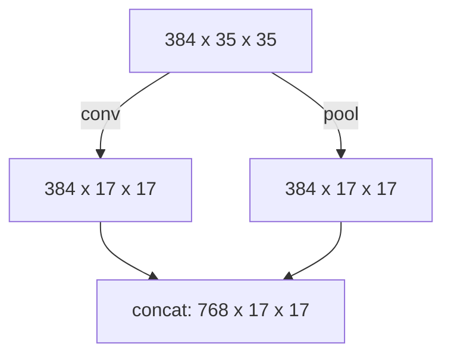

# Inception V2

The model was presented in [^Szegedy-2016].

The implementation is based on [this article](https://hackmd.io/@machine-learning/SkD5Xd4DL).

[^Szegedy-2016]: Szegedy C, Vanhoucke V, Ioffe S, Shlens J, Wojna ZB. 
    Rethinking the Inception Architecture for Computer Vision. 
    2016. [doi:10.1109/CVPR.2016.308](https://doi.org/10.1109/CVPR.2016.308)

## Structure

| type             | kernel size/stride or remark | input size |
|------------------|:----------------------------:|:----------:|
| conv             |             3x3/2            |  3x299x299 |
| conv             |             3x3/1            | 32x149x149 |
| conv pad         |             3x3/1            | 32x147x147 |
| pool             |             3x3/2            | 64x147x147 |
| conv             |             3x3/1            |  64x73x73  |
| conv             |             3x3/2            |  80x71x71  |
| conv             |             3x3/1            |  192x35x35 |
| 3 x Inception F5 |                              |  288x35x35 |
| 5 x Inception F6 |                              |  768x17x17 |
| 2 x Inception F7 |                              |  1280x8x8  |
| pool             |              8x8             |  2048x8x8  |
| linear           |            logits            |   2048x1   |
| softmax          |          classifier          |   1000x1   |

```text
===========================================================================================================================================================
Layer (type:depth-idx)                                  Kernel Shape              Input Shape               Output Shape              Param #
===========================================================================================================================================================
InceptionV2                                             --                        [1, 3, 299, 299]          [1, 3]                    --
├─InceptionFeatures: 1-1                                --                        [1, 3, 299, 299]          [1, 2048, 8, 8]           --
│    └─Sequential: 2-1                                  --                        [1, 3, 299, 299]          [1, 288, 35, 35]          --
│    │    └─BasicConv2d: 3-1                            --                        [1, 3, 299, 299]          [1, 32, 149, 149]         928
│    │    └─BasicConv2d: 3-2                            --                        [1, 32, 149, 149]         [1, 32, 147, 147]         9,280
│    │    └─BasicConv2d: 3-3                            --                        [1, 32, 147, 147]         [1, 64, 147, 147]         18,560
│    │    └─MaxPool2d: 3-4                              3                         [1, 64, 147, 147]         [1, 64, 73, 73]           --
│    │    └─BasicConv2d: 3-5                            --                        [1, 64, 73, 73]           [1, 80, 71, 71]           46,240
│    │    └─BasicConv2d: 3-6                            --                        [1, 80, 71, 71]           [1, 192, 35, 35]          138,624
│    │    └─BasicConv2d: 3-7                            --                        [1, 192, 35, 35]          [1, 288, 35, 35]          498,240
│    └─RepeatedModule: 2-2                              --                        [1, 288, 35, 35]          [1, 288, 35, 35]          --
│    │    └─InceptionModuleF5: 3-8                      --                        [1, 288, 35, 35]          [1, 288, 35, 35]          236,000
│    │    └─InceptionModuleF5: 3-9                      --                        [1, 288, 35, 35]          [1, 288, 35, 35]          236,000
│    │    └─InceptionModuleF5: 3-10                     --                        [1, 288, 35, 35]          [1, 288, 35, 35]          236,000
│    └─GridReduction: 2-3                               --                        [1, 288, 35, 35]          [1, 768, 17, 17]          --
│    │    └─InceptionBranch: 3-11                       --                        [1, 288, 35, 35]          [1, 178, 17, 17]          406,956
│    │    └─InceptionBranch: 3-12                       --                        [1, 288, 35, 35]          [1, 302, 17, 17]          193,116
│    │    └─InceptionBranch: 3-13                       --                        [1, 288, 35, 35]          [1, 288, 17, 17]          --
│    └─Sequential: 2-4                                  --                        [1, 768, 17, 17]          [1, 768, 17, 17]          --
│    │    └─InceptionModuleF6: 3-14                     --                        [1, 768, 17, 17]          [1, 768, 17, 17]          1,297,408
│    │    └─InceptionModuleF6: 3-15                     --                        [1, 768, 17, 17]          [1, 768, 17, 17]          1,691,008
│    │    └─InceptionModuleF6: 3-16                     --                        [1, 768, 17, 17]          [1, 768, 17, 17]          1,691,008
│    │    └─InceptionModuleF6: 3-17                     --                        [1, 768, 17, 17]          [1, 768, 17, 17]          1,691,008
│    │    └─InceptionModuleF6: 3-18                     --                        [1, 768, 17, 17]          [1, 768, 17, 17]          2,141,952
│    └─InceptionAux: 2-5                                --                        [1, 768, 17, 17]          [1, 3]                    --
│    │    └─AvgPool2d: 3-19                             5                         [1, 768, 17, 17]          [1, 768, 5, 5]            --
│    │    └─BasicConv2d: 3-20                           --                        [1, 768, 5, 5]            [1, 128, 5, 5]            98,560
│    │    └─BasicConv2d: 3-21                           --                        [1, 128, 5, 5]            [1, 768, 1, 1]            2,459,136
│    │    └─AdaptiveAvgPool2d: 3-22                     --                        [1, 768, 1, 1]            [1, 768, 1, 1]            --
│    │    └─Flatten: 3-23                               --                        [1, 768, 1, 1]            [1, 768]                  --
│    │    └─Linear: 3-24                                --                        [1, 768]                  [1, 3]                    2,307
│    └─GridReduction: 2-6                               --                        [1, 768, 17, 17]          [1, 1280, 8, 8]           --
│    │    └─InceptionBranch: 3-25                       --                        [1, 768, 17, 17]          [1, 194, 8, 8]            822,572
│    │    └─InceptionBranch: 3-26                       --                        [1, 768, 17, 17]          [1, 318, 8, 8]            697,980
│    │    └─InceptionBranch: 3-27                       --                        [1, 768, 17, 17]          [1, 768, 8, 8]            --
│    └─Sequential: 2-7                                  --                        [1, 1280, 8, 8]           [1, 2048, 8, 8]           --
│    │    └─InceptionModuleF7: 3-28                     --                        [1, 1280, 8, 8]           [1, 2048, 8, 8]           5,044,608
│    │    └─InceptionModuleF7: 3-29                     --                        [1, 2048, 8, 8]           [1, 2048, 8, 8]           6,076,800
├─AdaptiveAvgPool2d: 1-2                                --                        [1, 2048, 8, 8]           [1, 2048, 1, 1]           --
├─Dropout: 1-3                                          --                        [1, 2048, 1, 1]           [1, 2048, 1, 1]           --
├─Flatten: 1-4                                          --                        [1, 2048, 1, 1]           [1, 2048]                 --
├─Linear: 1-5                                           --                        [1, 2048]                 [1, 3]                    6,147
===========================================================================================================================================================
Total params: 25,740,438
Trainable params: 25,740,438
Non-trainable params: 0
Total mult-adds (Units.GIGABYTES): 6.20
===========================================================================================================================================================
Input size (MB): 1.07
Forward/backward pass size (MB): 147.70
Params size (MB): 102.96
Estimated Total Size (MB): 251.73
===========================================================================================================================================================
```

### Inception Modules

#### Inception Module F5

The module is presented on Figure 5 in [^Szegedy-2016].

```mermaid
graph TD;
    classDef convNode stroke:#FFFF00;
    classDef poolNode stroke:#00FFFF;
    classDef simpleText stroke-opacity:0, fill-opacity: 0;
    
    Base:::simpleText ---> B[Conv(kernel=1 x 1)]:::convNode & C[Conv(kernel=1 x 1)]:::convNode & D[Pool(max, kernel=3 x 3, pad=1)]:::poolNode & E[Conv(kernel=1 x 1)]:::convNode;
    B --> B1[Conv(kernel=3 x 3, pad=1)]:::convNode --> B2[Conv(kernel=3 x 3, pad=1)]:::convNode;
    C --> C1[Conv(kernel=3 x 3, pad=1)]:::convNode;
    D --> D1[Conv(kernel=1 x 1)]:::convNode;
    B2 & C1 & D1 & E --> Concat:::simpleText;
```

```text
============================================================================================================================================
Layer (type:depth-idx)                   Kernel Shape              Input Shape               Output Shape              Param #
============================================================================================================================================
InceptionModuleF5                        --                        [1, 288, 35, 35]          [1, 288, 35, 35]          --
├─InceptionBranch: 1-1                   --                        [1, 288, 35, 35]          [1, 96, 35, 35]           --
│    └─BasicConv2d: 2-1                  --                        [1, 288, 35, 35]          [1, 64, 35, 35]           --
│    │    └─Conv2d: 3-1                  [1, 1]                    [1, 288, 35, 35]          [1, 64, 35, 35]           18,432
│    │    └─BatchNorm2d: 3-2             --                        [1, 64, 35, 35]           [1, 64, 35, 35]           128
│    └─BasicConv2d: 2-2                  --                        [1, 64, 35, 35]           [1, 96, 35, 35]           --
│    │    └─Conv2d: 3-3                  [3, 3]                    [1, 64, 35, 35]           [1, 96, 35, 35]           55,296
│    │    └─BatchNorm2d: 3-4             --                        [1, 96, 35, 35]           [1, 96, 35, 35]           192
│    └─BasicConv2d: 2-3                  --                        [1, 96, 35, 35]           [1, 96, 35, 35]           --
│    │    └─Conv2d: 3-5                  [3, 3]                    [1, 96, 35, 35]           [1, 96, 35, 35]           82,944
│    │    └─BatchNorm2d: 3-6             --                        [1, 96, 35, 35]           [1, 96, 35, 35]           192
├─InceptionBranch: 1-2                   --                        [1, 288, 35, 35]          [1, 64, 35, 35]           --
│    └─BasicConv2d: 2-4                  --                        [1, 288, 35, 35]          [1, 48, 35, 35]           --
│    │    └─Conv2d: 3-7                  [1, 1]                    [1, 288, 35, 35]          [1, 48, 35, 35]           13,824
│    │    └─BatchNorm2d: 3-8             --                        [1, 48, 35, 35]           [1, 48, 35, 35]           96
│    └─BasicConv2d: 2-5                  --                        [1, 48, 35, 35]           [1, 64, 35, 35]           --
│    │    └─Conv2d: 3-9                  [3, 3]                    [1, 48, 35, 35]           [1, 64, 35, 35]           27,648
│    │    └─BatchNorm2d: 3-10            --                        [1, 64, 35, 35]           [1, 64, 35, 35]           128
├─InceptionBranch: 1-3                   --                        [1, 288, 35, 35]          [1, 64, 35, 35]           --
│    └─MaxPool2d: 2-6                    3                         [1, 288, 35, 35]          [1, 288, 35, 35]          --
│    └─BasicConv2d: 2-7                  --                        [1, 288, 35, 35]          [1, 64, 35, 35]           --
│    │    └─Conv2d: 3-11                 [1, 1]                    [1, 288, 35, 35]          [1, 64, 35, 35]           18,432
│    │    └─BatchNorm2d: 3-12            --                        [1, 64, 35, 35]           [1, 64, 35, 35]           128
├─InceptionBranch: 1-4                   --                        [1, 288, 35, 35]          [1, 64, 35, 35]           --
│    └─BasicConv2d: 2-8                  --                        [1, 288, 35, 35]          [1, 64, 35, 35]           --
│    │    └─Conv2d: 3-13                 [1, 1]                    [1, 288, 35, 35]          [1, 64, 35, 35]           18,432
│    │    └─BatchNorm2d: 3-14            --                        [1, 64, 35, 35]           [1, 64, 35, 35]           128
============================================================================================================================================
Total params: 236,000
Trainable params: 236,000
Non-trainable params: 0
Total mult-adds (Units.MEGABYTES): 287.89
============================================================================================================================================
Input size (MB): 1.41
Forward/backward pass size (MB): 9.72
Params size (MB): 0.94
Estimated Total Size (MB): 12.08
============================================================================================================================================
```

#### Inception Module F6

The module is presented in Figure 6 in [^Szegedy-2016].

```mermaid
graph TD;
    classDef convNode stroke:#FFFF00;
    classDef poolNode stroke:#00FFFF;
    classDef simpleText stroke-opacity:0, fill-opacity: 0;
    
    Base::simpleText ---> B[Conv(kernel=1 x 1)]:::convNode & C[Conv(kernel=1 x 1)]:::convNode & D[Pool(max,kernel=3 x 3, stride=1, pad=1)]:::poolNode & E[Conv(kernel=1 x 1)]:::convNode;
    B --> B1[Conv(kernel=1 x n, pad=0 x n/2)]:::convNode --> B2[Conv(kernel=n x 1, pad=n/2 x 0)]:::convNode --> B3[Conv(kernel=1 x n, pad=0 x n/2)]:::convNode --> B4[Conv(kernel=n x 1, pad=n/2 x 0)]:::convNode;
    C --> C1[Conv(kernel=1 x n, pad=0 x n/2)]:::convNode --> C2[Conv(kernel=n x 1, pad=n/2 x 0)]:::convNode;
    D --> D1[Conv(kernel=1 x 1)]:::convNode;
    B4 & C2 & D1 & E --> Concat::simpleText;
```

```text
============================================================================================================================================
Layer (type:depth-idx)                   Kernel Shape              Input Shape               Output Shape              Param #
============================================================================================================================================
InceptionModuleF6                        --                        [1, 768, 17, 17]          [1, 768, 17, 17]          --
├─InceptionBranch: 1-1                   --                        [1, 768, 17, 17]          [1, 192, 17, 17]          --
│    └─BasicConv2d: 2-1                  --                        [1, 768, 17, 17]          [1, 160, 17, 17]          --
│    │    └─Conv2d: 3-1                  [1, 1]                    [1, 768, 17, 17]          [1, 160, 17, 17]          122,880
│    │    └─BatchNorm2d: 3-2             --                        [1, 160, 17, 17]          [1, 160, 17, 17]          320
│    └─BasicConv2d: 2-2                  --                        [1, 160, 17, 17]          [1, 160, 17, 17]          --
│    │    └─Conv2d: 3-3                  [1, 7]                    [1, 160, 17, 17]          [1, 160, 17, 17]          179,200
│    │    └─BatchNorm2d: 3-4             --                        [1, 160, 17, 17]          [1, 160, 17, 17]          320
│    └─BasicConv2d: 2-3                  --                        [1, 160, 17, 17]          [1, 160, 17, 17]          --
│    │    └─Conv2d: 3-5                  [7, 1]                    [1, 160, 17, 17]          [1, 160, 17, 17]          179,200
│    │    └─BatchNorm2d: 3-6             --                        [1, 160, 17, 17]          [1, 160, 17, 17]          320
│    └─BasicConv2d: 2-4                  --                        [1, 160, 17, 17]          [1, 160, 17, 17]          --
│    │    └─Conv2d: 3-7                  [1, 7]                    [1, 160, 17, 17]          [1, 160, 17, 17]          179,200
│    │    └─BatchNorm2d: 3-8             --                        [1, 160, 17, 17]          [1, 160, 17, 17]          320
│    └─BasicConv2d: 2-5                  --                        [1, 160, 17, 17]          [1, 192, 17, 17]          --
│    │    └─Conv2d: 3-9                  [7, 1]                    [1, 160, 17, 17]          [1, 192, 17, 17]          215,040
│    │    └─BatchNorm2d: 3-10            --                        [1, 192, 17, 17]          [1, 192, 17, 17]          384
├─InceptionBranch: 1-2                   --                        [1, 768, 17, 17]          [1, 192, 17, 17]          --
│    └─BasicConv2d: 2-6                  --                        [1, 768, 17, 17]          [1, 160, 17, 17]          --
│    │    └─Conv2d: 3-11                 [1, 1]                    [1, 768, 17, 17]          [1, 160, 17, 17]          122,880
│    │    └─BatchNorm2d: 3-12            --                        [1, 160, 17, 17]          [1, 160, 17, 17]          320
│    └─BasicConv2d: 2-7                  --                        [1, 160, 17, 17]          [1, 160, 17, 17]          --
│    │    └─Conv2d: 3-13                 [1, 7]                    [1, 160, 17, 17]          [1, 160, 17, 17]          179,200
│    │    └─BatchNorm2d: 3-14            --                        [1, 160, 17, 17]          [1, 160, 17, 17]          320
│    └─BasicConv2d: 2-8                  --                        [1, 160, 17, 17]          [1, 192, 17, 17]          --
│    │    └─Conv2d: 3-15                 [7, 1]                    [1, 160, 17, 17]          [1, 192, 17, 17]          215,040
│    │    └─BatchNorm2d: 3-16            --                        [1, 192, 17, 17]          [1, 192, 17, 17]          384
├─InceptionBranch: 1-3                   --                        [1, 768, 17, 17]          [1, 192, 17, 17]          --
│    └─MaxPool2d: 2-9                    3                         [1, 768, 17, 17]          [1, 768, 17, 17]          --
│    └─BasicConv2d: 2-10                 --                        [1, 768, 17, 17]          [1, 192, 17, 17]          --
│    │    └─Conv2d: 3-17                 [1, 1]                    [1, 768, 17, 17]          [1, 192, 17, 17]          147,456
│    │    └─BatchNorm2d: 3-18            --                        [1, 192, 17, 17]          [1, 192, 17, 17]          384
├─InceptionBranch: 1-4                   --                        [1, 768, 17, 17]          [1, 192, 17, 17]          --
│    └─BasicConv2d: 2-11                 --                        [1, 768, 17, 17]          [1, 192, 17, 17]          --
│    │    └─Conv2d: 3-19                 [1, 1]                    [1, 768, 17, 17]          [1, 192, 17, 17]          147,456
│    │    └─BatchNorm2d: 3-20            --                        [1, 192, 17, 17]          [1, 192, 17, 17]          384
============================================================================================================================================
Total params: 1,691,008
Trainable params: 1,691,008
Non-trainable params: 0
Total mult-adds (Units.MEGABYTES): 487.71
============================================================================================================================================
Input size (MB): 0.89
Forward/backward pass size (MB): 7.99
Params size (MB): 6.76
Estimated Total Size (MB): 15.64
============================================================================================================================================
```

#### Inception Module F7

The module is presented in Figure 7 in [^Szegedy-2016].

```mermaid
graph TD;
    classDef convNode stroke:#FFFF00;
    classDef poolNode stroke:#00FFFF;
    classDef simpleText stroke-opacity:0, fill-opacity: 0;
    
    Base:::simpleText ---> B[Conv(kernel=1 x 1)]:::convNode & C[Conv(kernel=1 x 1)]:::convNode & D[Pool(max, kernel=3 x 3, stride=1)]:::poolNode & E[Conv(kernel=1 x 1)]:::convNode;
    B --> B1[Conv(kernel=3 x 3, pad=1)]:::convNode --> B3[Conv(kernel=1 x 3, pad=0 x 1)]:::convNode;
    B1 --> B4[Conv(kernel=3 x 1, pad=1 x 0)]:::convNode;
    C --> C1[Conv(kernel=1 x 3, pad=0 x 1)]:::convNode;
    C --> C2[Conv(kernel=3 x 1, pad=1 x 0)]:::convNode;
    D --> D1[Conv(kernel=1 x 1)]:::convNode;
    B3 & B4 & C1 & C2 & D1 & E --> Concat:::simpleText;
```

```text
============================================================================================================================================
Layer (type:depth-idx)                   Kernel Shape              Input Shape               Output Shape              Param #
============================================================================================================================================
InceptionModuleF7                        --                        [1, 1280, 8, 8]           [1, 2048, 8, 8]           --
├─InceptionBranch: 1-1                   --                        [1, 1280, 8, 8]           [1, 768, 8, 8]            --
│    └─BasicConv2d: 2-1                  --                        [1, 1280, 8, 8]           [1, 448, 8, 8]            --
│    │    └─Conv2d: 3-1                  [1, 1]                    [1, 1280, 8, 8]           [1, 448, 8, 8]            573,440
│    │    └─BatchNorm2d: 3-2             --                        [1, 448, 8, 8]            [1, 448, 8, 8]            896
│    └─BasicConv2d: 2-2                  --                        [1, 448, 8, 8]            [1, 384, 8, 8]            --
│    │    └─Conv2d: 3-3                  [3, 3]                    [1, 448, 8, 8]            [1, 384, 8, 8]            1,548,288
│    │    └─BatchNorm2d: 3-4             --                        [1, 384, 8, 8]            [1, 384, 8, 8]            768
├─Sequential: 1-2                        --                        [1, 384, 8, 8]            [1, 384, 8, 8]            --
│    └─InceptionBranch: 2-3              --                        [1, 384, 8, 8]            [1, 384, 8, 8]            --
│    │    └─BasicConv2d: 3-5             --                        [1, 384, 8, 8]            [1, 384, 8, 8]            443,136
├─Sequential: 1-3                        --                        [1, 384, 8, 8]            [1, 384, 8, 8]            --
│    └─InceptionBranch: 2-4              --                        [1, 384, 8, 8]            [1, 384, 8, 8]            --
│    │    └─BasicConv2d: 3-6             --                        [1, 384, 8, 8]            [1, 384, 8, 8]            443,136
├─InceptionBranch: 1-4                   --                        [1, 1280, 8, 8]           [1, 768, 8, 8]            --
│    └─BasicConv2d: 2-5                  --                        [1, 1280, 8, 8]           [1, 384, 8, 8]            --
│    │    └─Conv2d: 3-7                  [1, 1]                    [1, 1280, 8, 8]           [1, 384, 8, 8]            491,520
│    │    └─BatchNorm2d: 3-8             --                        [1, 384, 8, 8]            [1, 384, 8, 8]            768
├─Sequential: 1-5                        --                        [1, 384, 8, 8]            [1, 384, 8, 8]            --
│    └─InceptionBranch: 2-6              --                        [1, 384, 8, 8]            [1, 384, 8, 8]            --
│    │    └─BasicConv2d: 3-9             --                        [1, 384, 8, 8]            [1, 384, 8, 8]            443,136
├─Sequential: 1-6                        --                        [1, 384, 8, 8]            [1, 384, 8, 8]            --
│    └─InceptionBranch: 2-7              --                        [1, 384, 8, 8]            [1, 384, 8, 8]            --
│    │    └─BasicConv2d: 3-10            --                        [1, 384, 8, 8]            [1, 384, 8, 8]            443,136
├─InceptionBranch: 1-7                   --                        [1, 1280, 8, 8]           [1, 192, 8, 8]            --
│    └─MaxPool2d: 2-8                    3                         [1, 1280, 8, 8]           [1, 1280, 8, 8]           --
│    └─BasicConv2d: 2-9                  --                        [1, 1280, 8, 8]           [1, 192, 8, 8]            --
│    │    └─Conv2d: 3-11                 [1, 1]                    [1, 1280, 8, 8]           [1, 192, 8, 8]            245,760
│    │    └─BatchNorm2d: 3-12            --                        [1, 192, 8, 8]            [1, 192, 8, 8]            384
├─InceptionBranch: 1-8                   --                        [1, 1280, 8, 8]           [1, 320, 8, 8]            --
│    └─BasicConv2d: 2-10                 --                        [1, 1280, 8, 8]           [1, 320, 8, 8]            --
│    │    └─Conv2d: 3-13                 [1, 1]                    [1, 1280, 8, 8]           [1, 320, 8, 8]            409,600
│    │    └─BatchNorm2d: 3-14            --                        [1, 320, 8, 8]            [1, 320, 8, 8]            640
============================================================================================================================================
Total params: 5,044,608
Trainable params: 5,044,608
Non-trainable params: 0
Total mult-adds (Units.MEGABYTES): 322.44
============================================================================================================================================
Input size (MB): 0.33
Forward/backward pass size (MB): 3.34
Params size (MB): 20.18
Estimated Total Size (MB): 23.85
============================================================================================================================================
```

#### Grid Size reduction



```text
============================================================================================================================================
Layer (type:depth-idx)                   Kernel Shape              Input Shape               Output Shape              Param #
============================================================================================================================================
GridReduction                            --                        [1, 384, 35, 35]          [1, 1152, 17, 17]         --
├─InceptionBranch: 1-1                   --                        [1, 384, 35, 35]          [1, 384, 17, 17]          --
│    └─BasicConv2d: 2-1                  --                        [1, 384, 35, 35]          [1, 384, 35, 35]          --
│    │    └─Conv2d: 3-1                  [1, 1]                    [1, 384, 35, 35]          [1, 384, 35, 35]          147,456
│    │    └─BatchNorm2d: 3-2             --                        [1, 384, 35, 35]          [1, 384, 35, 35]          768
│    └─BasicConv2d: 2-2                  --                        [1, 384, 35, 35]          [1, 384, 35, 35]          --
│    │    └─Conv2d: 3-3                  [3, 3]                    [1, 384, 35, 35]          [1, 384, 35, 35]          1,327,104
│    │    └─BatchNorm2d: 3-4             --                        [1, 384, 35, 35]          [1, 384, 35, 35]          768
│    └─BasicConv2d: 2-3                  --                        [1, 384, 35, 35]          [1, 384, 17, 17]          --
│    │    └─Conv2d: 3-5                  [3, 3]                    [1, 384, 35, 35]          [1, 384, 17, 17]          1,327,104
│    │    └─BatchNorm2d: 3-6             --                        [1, 384, 17, 17]          [1, 384, 17, 17]          768
├─InceptionBranch: 1-2                   --                        [1, 384, 35, 35]          [1, 384, 17, 17]          --
│    └─BasicConv2d: 2-4                  --                        [1, 384, 35, 35]          [1, 384, 35, 35]          --
│    │    └─Conv2d: 3-7                  [1, 1]                    [1, 384, 35, 35]          [1, 384, 35, 35]          147,456
│    │    └─BatchNorm2d: 3-8             --                        [1, 384, 35, 35]          [1, 384, 35, 35]          768
│    └─BasicConv2d: 2-5                  --                        [1, 384, 35, 35]          [1, 384, 17, 17]          --
│    │    └─Conv2d: 3-9                  [3, 3]                    [1, 384, 35, 35]          [1, 384, 17, 17]          1,327,104
│    │    └─BatchNorm2d: 3-10            --                        [1, 384, 17, 17]          [1, 384, 17, 17]          768
├─InceptionBranch: 1-3                   --                        [1, 384, 35, 35]          [1, 384, 17, 17]          --
│    └─MaxPool2d: 2-6                    3                         [1, 384, 35, 35]          [1, 384, 17, 17]          --
============================================================================================================================================
Total params: 4,280,064
Trainable params: 4,280,064
Non-trainable params: 0
Total mult-adds (Units.GIGABYTES): 2.75
============================================================================================================================================
Input size (MB): 1.88
Forward/backward pass size (MB): 26.13
Params size (MB): 17.12
Estimated Total Size (MB): 45.13
============================================================================================================================================
```
