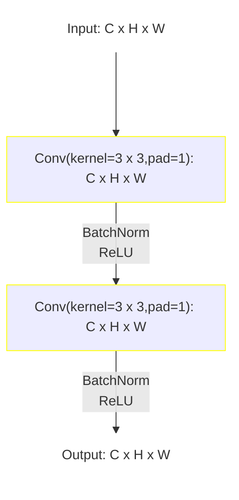
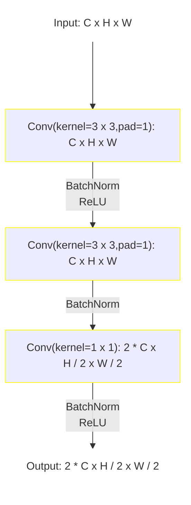
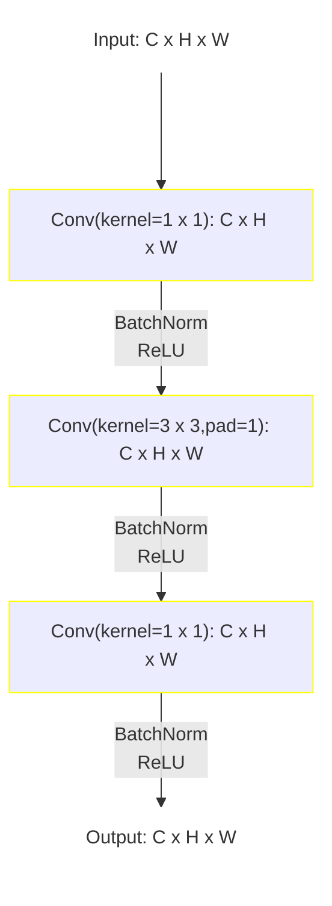
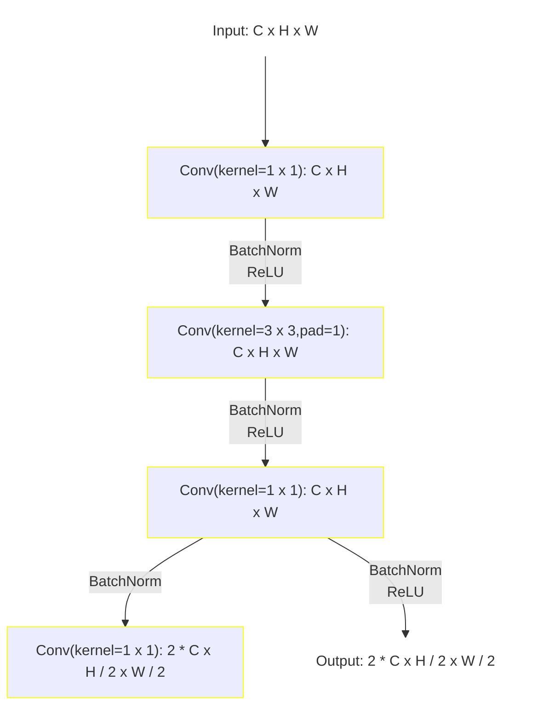

# AlexNet

The model was presented in [^He-2015].

The implementation from [`torchvision.models`](https://pytorch.org/vision/main/models/resnet.html) is used.

## Model structure

ResNet models are constructed from `Basic` or `Bottleneck` blocks.

BasicBlock:

BasicBlock/2 with downsample:


Bottleneck:

Bottleneck/2 with downsample:


### ResNet-18

```mermaid
graph TD;
    classDef convNode stroke:#FFFF00;
    classDef poolNode stroke:#00FFFF;
    classDef linearNode stroke:#00FF00;
    classDef simpleText stroke-opacity:0, fill-opacity: 0;
    
    INPUT[Input: 1 x 116 x 116]:::simpleText ---> B["Conv(kernel=7 x 7,stride=2,pad=3): 64 x 58 x 58"]:::convNode;
    B -- BatchNorm <br/> ReLU --> C["Pool(max,kernel=3 x 3,stride=2,pad=1): 64 x 29 x 29"]:::poolNode;
    subgraph block 1;
    C --> D["BasicBlock: 64 x 29 x 29"]:::convNode;
    D --> E["BasicBlock: 64 x 29 x 29"]::convNode;
    end;
    subgraph block 2;
    E --> F["BasicBlock/2: 128 x 15 x 15"]:::convNode;
    F --> G["BasicBlock: 128 x 15 x 15"]::convNode;
    end;
    subgraph block 3;
    G --> H["BasicBlock/2: 256 x 8 x 8"]:::convNode;
    H --> I["BasicBlock: 256 x 8 x 8"]::convNode;
    end;
    subgraph block 4;
    I --> J["BasicBlock/2: 512 x 4 x 4"]:::convNode;
    J --> K["BasicBlock: 512 x 4 x 4"]::convNode;
    end;
    K --> L["AdaptivePool(avg,kernel=1 x 1): 512 x 1 x 1"]:::poolNode;
    L --> M["Linear(): n_classes"]:::linearNode;
    M --> OUTPUT[Output: n_classes]:::simpleText;
```

```text
============================================================================================================================================
Layer (type:depth-idx)                   Input Shape               Output Shape              Kernel Shape              Param #
============================================================================================================================================
ResNet                                     [1, 1, 116, 116]          [1, 2]                    --                        --
├─Conv2d: 1-1                              [1, 1, 116, 116]          [1, 64, 58, 58]           [7, 7]                    3,136
├─BatchNorm2d: 1-2                         [1, 64, 58, 58]           [1, 64, 58, 58]           --                        128
├─ReLU: 1-3                                [1, 64, 58, 58]           [1, 64, 58, 58]           --                        --
├─MaxPool2d: 1-4                           [1, 64, 58, 58]           [1, 64, 29, 29]           3                         --
├─Sequential: 1-5                          [1, 64, 29, 29]           [1, 64, 29, 29]           --                        --
│    └─BasicBlock: 2-1                     [1, 64, 29, 29]           [1, 64, 29, 29]           --                        --
│    └─BasicBlock: 2-2                     [1, 64, 29, 29]           [1, 64, 29, 29]           --                        --
├─Sequential: 1-6                          [1, 64, 29, 29]           [1, 128, 15, 15]          --                        --
│    └─BasicBlock/2: 2-3                   [1, 64, 29, 29]           [1, 128, 15, 15]          --                        --
│    └─BasicBlock: 2-4                     [1, 128, 15, 15]          [1, 128, 15, 15]          --                        --
├─Sequential: 1-7                          [1, 128, 15, 15]          [1, 256, 8, 8]            --                        --
│    └─BasicBlock/2: 2-5                   [1, 128, 15, 15]          [1, 256, 8, 8]            --                        --
│    └─BasicBlock: 2-6                     [1, 256, 8, 8]            [1, 256, 8, 8]            --                        --
├─Sequential: 1-8                          [1, 256, 8, 8]            [1, 512, 4, 4]            --                        --
│    └─BasicBlock/2: 2-7                   [1, 256, 8, 8]            [1, 512, 4, 4]            --                        --
│    └─BasicBlock: 2-8                     [1, 512, 4, 4]            [1, 512, 4, 4]            --                        --
├─AdaptiveAvgPool2d: 1-9                   [1, 512, 4, 4]            [1, 512, 1, 1]            --                        --
├─Linear: 1-10                             [1, 512]                  [1, 2]                    --                        1,026
============================================================================================================================================
Total params: 11,171,266
Trainable params: 11,171,266
Non-trainable params: 0
Total mult-adds (Units.MEGABYTES): 520.97
============================================================================================================================================
Input size (MB): 0.05
Forward/backward pass size (MB): 11.16
Params size (MB): 44.69
Estimated Total Size (MB): 55.90
============================================================================================================================================
```

### ResNet-50

```mermaid
graph TD;
    classDef convNode stroke:#FFFF00;
    classDef poolNode stroke:#00FFFF;
    classDef linearNode stroke:#00FF00;
    classDef simpleText stroke-opacity:0, fill-opacity: 0;
    
    INPUT[Input: 1 x 116 x 116]:::simpleText ---> B["Conv(kernel=7 x 7,stride=2,pad=3): 64 x 58 x 58"]:::convNode;
    B -- BatchNorm <br/> ReLU --> C["Pool(max,kernel=3 x 3,stride=2,pad=1): 64 x 29 x 29"]:::poolNode;
    subgraph block 1;
    C --> D["Bottleneck/2: 256 x 29 x 29"]:::convNode;
    D --> E["Bottleneck: 256 x 29 x 29"]::convNode;
    E --> F["Bottleneck: 256 x 29 x 29"]::convNode;
    end;
    subgraph block 2;
    F --> G["Bottleneck/2: 512 x 15 x 15"]:::convNode;
    G --> H["Bottleneck: 512 x 15 x 15"]::convNode;
    H --> I["Bottleneck: 512 x 15 x 15"]::convNode;
    I --> J["Bottleneck: 512 x 15 x 15"]::convNode;
    end;
    subgraph block 3;
    J --> K["Bottleneck/2: 1024 x 8 x 8"]:::convNode;
    K --> L["Bottleneck: 1024 x 8 x 8"]::convNode;
    L --> M["Bottleneck: 1024 x 8 x 8"]::convNode;
    M --> N["Bottleneck: 1024 x 8 x 8"]::convNode;
    N --> O["Bottleneck: 1024 x 8 x 8"]::convNode;
    O --> P["Bottleneck: 1024 x 8 x 8"]::convNode;
    end;
    subgraph block 4;
    P --> Q["Bottleneck/2: 2048 x 4 x 4"]:::convNode;
    Q --> R["Bottleneck: 2048 x 4 x 4"]::convNode;
    R --> S["Bottleneck: 2048 x 4 x 4"]::convNode;
    end;
    S --> T["AdaptivePool(avg,kernel=1 x 1): 2048 x 1 x 1"]:::poolNode;
    T --> U["Linear(): n_classes"]:::linearNode;
    U --> OUTPUT[Output: n_classes]:::simpleText;
```

```text
============================================================================================================================================
Layer (type:depth-idx)                   Input Shape               Output Shape              Kernel Shape              Param #
============================================================================================================================================
ResNet                                     [1, 1, 116, 116]          [1, 2]                    --                        --
├─Conv2d: 1-1                              [1, 1, 116, 116]          [1, 64, 58, 58]           [7, 7]                    3,136
├─BatchNorm2d: 1-2                         [1, 64, 58, 58]           [1, 64, 58, 58]           --                        128
├─ReLU: 1-3                                [1, 64, 58, 58]           [1, 64, 58, 58]           --                        --
├─MaxPool2d: 1-4                           [1, 64, 58, 58]           [1, 64, 29, 29]           3                         --
├─Sequential: 1-5                          [1, 64, 29, 29]           [1, 256, 29, 29]          --                        --
│    └─Bottleneck/2: 2-1                   [1, 64, 29, 29]           [1, 256, 29, 29]          --                        --
│    └─Bottleneck: 2-2                     [1, 256, 29, 29]          [1, 256, 29, 29]          --                        --
│    └─Bottleneck: 2-3                     [1, 256, 29, 29]          [1, 256, 29, 29]          --                        --
├─Sequential: 1-6                          [1, 256, 29, 29]          [1, 512, 15, 15]          --                        --
│    └─Bottleneck/2: 2-4                   [1, 256, 29, 29]          [1, 512, 15, 15]          --                        --
│    └─Bottleneck: 2-5                     [1, 512, 15, 15]          [1, 512, 15, 15]          --                        --
│    └─Bottleneck: 2-6                     [1, 512, 15, 15]          [1, 512, 15, 15]          --                        --
│    └─Bottleneck: 2-7                     [1, 512, 15, 15]          [1, 512, 15, 15]          --                        --
├─Sequential: 1-7                          [1, 512, 15, 15]          [1, 1024, 8, 8]           --                        --
│    └─Bottleneck/2: 2-8                   [1, 512, 15, 15]          [1, 1024, 8, 8]           --                        --
│    └─Bottleneck: 2-9                     [1, 1024, 8, 8]           [1, 1024, 8, 8]           --                        --
│    └─Bottleneck: 2-10                    [1, 1024, 8, 8]           [1, 1024, 8, 8]           --                        --
│    └─Bottleneck: 2-11                    [1, 1024, 8, 8]           [1, 1024, 8, 8]           --                        --
│    └─Bottleneck: 2-12                    [1, 1024, 8, 8]           [1, 1024, 8, 8]           --                        --
│    └─Bottleneck: 2-13                    [1, 1024, 8, 8]           [1, 1024, 8, 8]           --                        --
├─Sequential: 1-8                          [1, 1024, 8, 8]           [1, 2048, 4, 4]           --                        --
│    └─Bottleneck/2: 2-14                  [1, 1024, 8, 8]           [1, 2048, 4, 4]           --                        --
│    └─Bottleneck: 2-15                    [1, 2048, 4, 4]           [1, 2048, 4, 4]           --                        --
│    └─Bottleneck: 2-16                    [1, 2048, 4, 4]           [1, 2048, 4, 4]           --                        --
├─AdaptiveAvgPool2d: 1-9                   [1, 2048, 4, 4]           [1, 2048, 1, 1]           --                        --
├─Linear: 1-10                             [1, 2048]                 [1, 2]                    --                        4,098
============================================================================================================================================
Total params: 23,505,858
Trainable params: 23,505,858
Non-trainable params: 0
Total mult-adds (Units.GIGABYTES): 1.22
============================================================================================================================================
Input size (MB): 0.05
Forward/backward pass size (MB): 50.98
Params size (MB): 94.02
Estimated Total Size (MB): 145.05
============================================================================================================================================
```

[^He-2015]: He K, Zhang X, Ren S, and Sun J. Deep residual learning for image recognition. In Proceedings of the IEEE Conference on Computer Vision and Pattern Recognition (CVPR). 2015. [doi:10.1109/CVPR.2016.90](https://doi.org/10.1109/CVPR.2016.90)