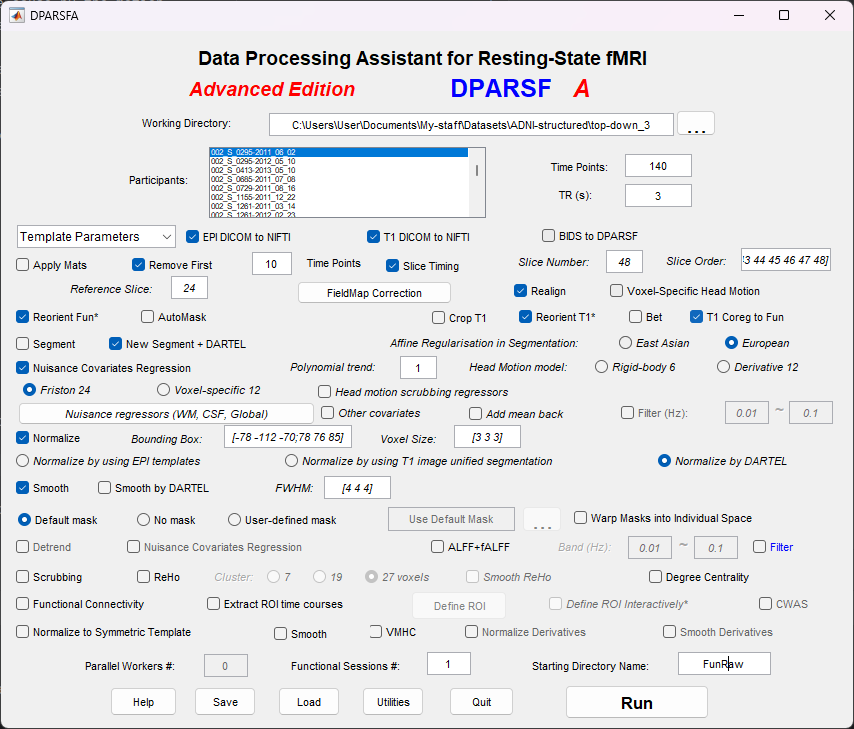
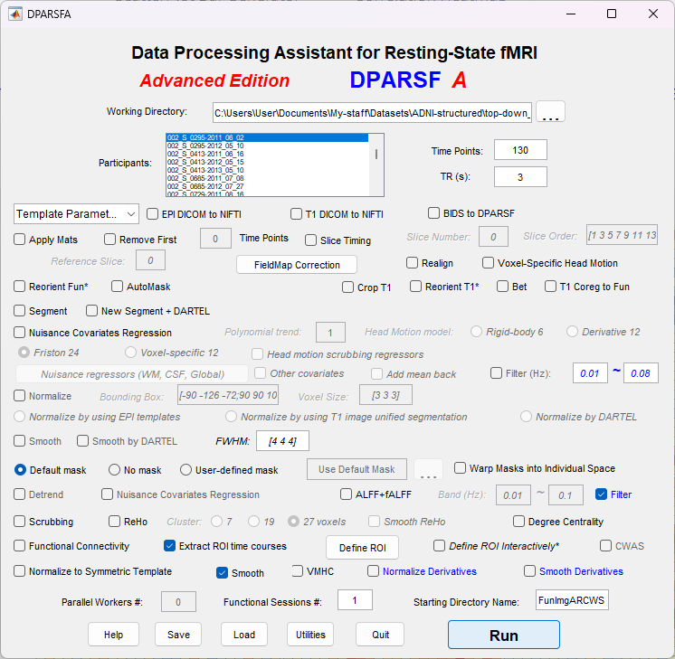

# Preprocessing

The current folder contains the scripts responsible for the preprocessing of the
data described in [^Sethuraman-2023], section 3.2.

Before jumping into the preprocessing we need to restructure the data.
DPARSF can convert DICOM data, but it should have a specific folder structure.

First, call
```shell
python restructure.py --dir --out-dir <NIFTI_DIR>
```
to restructure the data. It results in:
```
ADNI-structured
├── top-down_3
│   ├── <patient_id-scan_time>
│   └── ...
├── down-top_3
│   ├── <patient_id-scan_time>
│   └── ...
└── data.csv
```
where the folders correspond to `<scan_direction>_<tr>`.

Now we can start the actual preprocessing.

In [^Sethuraman-2023], the authors propose the use of SPM 12 in the preprocessing.
However, DPARSF [^DPARSF] (Data Processing Assistant for rsMRI) is built on SPM12.
Therefore, we will use only DPARSF.

At the beginning of the preprocessing the brain tissue is segmented into three classes: 
Gray Matter (GM), White Matter (WM) and Cerebrospinal Fluid (CSF).

Parameters:
* working directory: `ADNI-structured/<slice-order_TR>`
* time points: `140`
* tr: `3`
* starting directory name: `FunRaw` 

The following steps are performed:
1. **Removing the initial ten volumes**: usually the initial volumes are noisy,
therefore they are removed.
   * remove first: `10`
2. **Slice timing**: it takes time to record the full volume of the brain,
therefore usually slice timing is applied to provide uniformity in time 
variation. The **middle** slice is selected as the reference slice.
There are scans performed using top-down and down-top manner. This should be considered
when defining the slice order.
   * slice number: `48`
   * slice order:
      * top-down: `1:48`
      * down-top: `48:-1:1`
   * reference slice: `24`
3. **Realignment**: the scans are realigned to remove noise cause by the motion
of the patient, with regard to the reference (middle) slice.
4. Reoriant Fun* and Reoriant T1*
5. **Co-registration**: aligning the average functional image (defined in the
previous step) with the structural image using landmark-based registration 
technique.
6. **Segmentation**: the brain tissue is segmented into six classes
   * gray matter,
   * white matter, 
   * cerebrospinal fluid, 
   * bones,
   * soft tissue and
   * air/background
   
   We are interested in the first three.
   * New segment + DARTEL
7. Nuisance covariates regression:
   * polynomial trend: `1`
   * head motion model: `Friston 24`
8. **Normalization**: convert images to MNI (Montreal Neurological Institute) space (
voxel size <code>3 x 3 x 3 mm<sup>3</sup></code>)
   * bounding box: `[-78 -112 -70;78 76 85]`
   * voxel size: `[3 3 3]`
9. **Smoothing**: Gaussian kernel is applied to further reduce noise.
   * FWHM: `[4 4 4]`


Finally, the low frequency bands are defined. Merge the folders `FunImgARCWS` 
from `top-down_3` and `down-top_3` and run the extraction from the resulting 
folder. :bangbang: **Make sure to rename the result directory after each extraction** :bangbang:

* **slow4**: `0.027 Hz` - `0.08  Hz`
* **slow5**: `0.01  Hz` - `0.027 Hz`
* **full-band**: `0.01 Hz` - `0.08 Hz`



* At `Define ROI` only the AAL template should be selected.
* The `smooth` can be unchecked (we are interested in the resulting 
ROI signals but the smooth refers to the resulting brain image)

After the ROI signals are extracted call
```shell
python preprocessing/convert_signals.py
```
This script will convert the resulting `.txt` files to `.npz` for easier 
usage in the following.

Call 
```shell
python preprocessing/extact_metadata.py
```
to customize the metadata later used in the analysis.

[^DPARSF]: Chao-Gan Y, Yu-Feng Z. DPARSF: A MATLAB Toolbox for "Pipeline" Data
  Analysis of Resting-State fMRI. Front Syst Neurosci. 2010;4:13. Published 2010
  May 14. [doi:10.3389/fnsys.2010.00013](https://doi.org/10.3389/fnsys.2010.00013)
[^Sethuraman-2023]: Sethuraman SK, Malaiyappan N, Ramalingam R, Basheer S, 
  Rashid M, Ahmad N. Predicting Alzheimer’s Disease Using Deep Neuro-Functional
  Networks with Resting-State fMRI. Electronics. 2023; 12(4):1031.
  [doi:10.3390/electronics12041031](https://doi.org/10.3390/electronics12041031)
[^SPM12]: [SPM12](https://www.fil.ion.ucl.ac.uk/spm/software/spm12/)